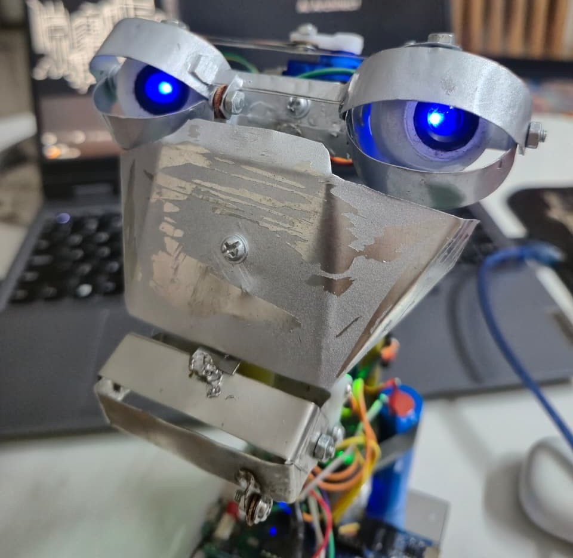
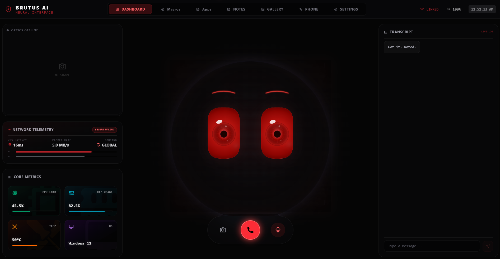
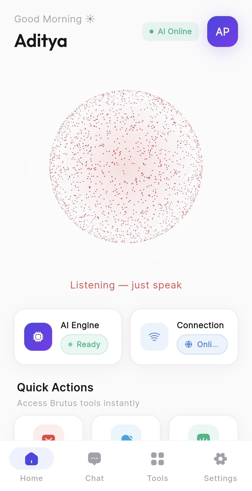

<div align="center">

# 🤖 Brutus AI

### Your AI assistant — with a physical face.

**A fully-featured Android AI assistant that controls a real humanoid robot head over Bluetooth.**

[](https://flutter.dev)
[](https://www.arduino.cc)
[](https://ai.google.dev)
[](https://developer.android.com)
[](LICENSE)

---

**Voice conversations** · **Live lip-sync** · **20 robot animations** · **Phone automation** · **Web search** · **Email** · **Vision** · **Screen share** · **Deep research** · **and more**

</div>

---

## 📸 See Brutus In Action

<div align="center">

### The Robot Face

<table>
<tr>
<td align="center" width="33%">

<br/><sub><b>Front view — servo layout & LED</b></sub>
</td>
<td align="center" width="33%">

<br/><sub><b>Internal wiring — Arduino + HM-10 + servos</b></sub>
</td>
<td align="center" width="33%">

<br/><sub><b>Completed assembly</b></sub>
</td>
</tr>
</table>

<br/>

<table>
<tr>
<td align="center" width="50%">

<br/><sub><b>Face close-up — eye & mouth servos in action</b></sub>
</td>
</tr>
</table>

<br/>

### The App (Windows OS)

<table>
<tr>
<td align="center" width="50%">

<br/><sub><b>Windows OS screen — Brutus running on desktop</b></sub>
</td>
<td align="center" width="50%">

<br/><sub><b>Windows OS screen — Brutus in action</b></sub>
</td>
</tr>
</table>

</div>

---

## 🌟 What is Brutus?

Brutus is two things in one:

1. **📱 An AI Assistant App** — Built with Flutter, powered by Google Gemini Live API. Real-time voice conversations, vision, screen control, emails, research, and 25+ tools — all through natural speech.

2. **🤖 A Physical Robot Head** — An Arduino-powered humanoid face with 4 servos (eyes, eyelids, mouth), an LED, and a mic. The app drives the robot's expressions, lip-syncs its mouth to Gemini's voice, and can trigger 20 pre-baked animation sequences — all over Bluetooth Low Energy.

When Brutus talks to you, his robot face **moves its mouth in sync**, changes expressions based on the **emotion in its speech**, and even nods, winks, or laughs on command.

---

## 📊 Project At A Glance

<div align="center">

| Metric | Value |
|---|---|
| 📱 **Screens** | 15 feature screens |
| 🛠️ **AI Tools** | 25+ callable tools |
| 🎭 **Robot Animations** | 20 (10 macros + 10 tricks) |
| 😊 **Expressions** | 6 (+ intensity slider 0–100%) |
| 🔩 **Servos** | 4 × SG90 (eyes X/Y, eyelid, mouth) |
| 📡 **BLE Commands** | 11 command types |
| 📦 **Dart Packages** | 30+ pub.dev dependencies |
| 🧩 **Riverpod Providers** | 12 StateNotifier providers |
| ⚙️ **Native Kotlin Channels** | 5 (Audio, Screen, Accessibility, Notifications, Automation) |
| 🤖 **AI Providers** | 4 (Gemini, Groq, Tavily, HuggingFace) |
| 🗂️ **Lines of Code (approx.)** | 15 000+ |
| 🏗️ **Architecture** | Feature-first + Riverpod + GoRouter |

</div>

---

## 🎬 How It Works

```
  You speak into your phone
         │
         ▼
  ┌──────────────┐
  │  Mic (PCM)   │ ──── echo-suppressed while Brutus speaks
  └──────┬───────┘
         │
         ▼
  ┌──────────────────┐      ┌───────────────────┐
  │  Gemini Live API │ ◄──► │  Camera / Screen   │
  │  (WebSocket)     │      │  (vision frames)   │
  └──────┬───────────┘      └───────────────────┘
         │
    ┌────┴────────────────────────┐
    │                             │
    ▼                             ▼
  ┌──────────┐          ┌────────────────┐
  │  Audio   │          │  Tool Calls    │
  │  (voice) │          │  (25+ tools)   │
  └────┬─────┘          └────────────────┘
       │
  ┌────┴──────────────────────────────────┐
  │                                        │
  ▼                                        ▼
  ┌────────────┐               ┌────────────────────┐
  │  Speaker   │               │  Robot (BLE)       │
  │  (AudioTrack)              │  lip-sync + emotion │
  └────────────┘               │  + LED patterns     │
                               └────────────────────┘
```

---

## ✨ App Features

### 🎙️ Voice & Conversation

| Feature | Description |
|---|---|
| **Real-time voice** | Gemini Live API over WebSocket — continuous mic streaming with server-side VAD |
| **Echo suppression** | Mic audio is dropped while Brutus speaks, preventing infinite response loops |
| **Barge-in** | Interrupt Brutus mid-sentence and he stops talking immediately |
| **Live transcripts** | See what you and Brutus are saying in real time |
| **REST fallback** | Seamlessly switches to text mode if the live connection drops |
| **Chat history** | Last 200 messages persisted locally via Hive |
| **Speak for me** | Type text and Brutus reads it aloud in his natural voice |

### 👁️ Vision & Screen Share

| Feature | Description |
|---|---|
| **Camera vision** | Point your camera at anything — Brutus sees and understands it via Gemini multimodal |
| **Screen share** | Share your device screen so Brutus can assist with what you're looking at |
| **Bandwidth modes** | Standard (720p · 5s) and Low data (480px · 7s) to suit your connection |
| **Smart frame-skip** | No frames sent while audio is active, preventing WebSocket contention |

### 🛠️ Tools & Integrations (25+)

<table>
<tr><td>

| 📬 **Communication** |
|---|
| Gmail — read & compose |
| WhatsApp auto-send |
| SMS composer |
| Phone calls |
| Contact lookup |

</td><td>

| 🔍 **Information** |
|---|
| Web search (Tavily) |
| Deep research (multi-source) |
| Weather (Open-Meteo) |
| Stock prices (Yahoo Finance) |
| On-device OCR |

</td><td>

| 📝 **Productivity** |
|---|
| Notes (create & browse) |
| RAG Oracle (document Q&A) |
| AI Gallery (image gen) |
| Maps (OpenStreetMap) |
| Timers |

</td><td>

| 📱 **Phone Automation** |
|---|
| Open any installed app |
| Flashlight toggle |
| Ringer mode control |
| Ghost typing |
| Screen reader |
| Notification reader |
| Tap any on-screen button |
| Global actions (back, home) |
| Settings panels (WiFi, BT) |

</td></tr>
</table>

### 🎨 UI & Design

- **Material 3** design system with warm indigo palette
- **Animated AI particle sphere** that reacts to Brutus's voice output level
- **Frosted-glass** bottom navigation
- Smooth **page transitions** (fade for tabs, slide-up for sub-pages)
- 15 feature screens — Home, Chat, Tools, Settings, Email, Notes, Research, Oracle, Gallery, Maps, Stocks, Weather, Automation, Search, Robot Control
- Built with `flutter_animate`, Iconsax icons, and Google Fonts (Inter / Outfit)

---

## 🆚 Brutus vs. Typical AI Assistants

<div align="center">

| Capability | Brutus AI | Google Assistant | Alexa | ChatGPT App |
|---|:---:|:---:|:---:|:---:|
| Real-time voice (WebSocket stream) | ✅ | ✅ | ✅ | ✅ |
| Physical robot face w/ lip-sync | ✅ | ❌ | ❌ | ❌ |
| Emotion-driven servo expressions | ✅ | ❌ | ❌ | ❌ |
| 20 named animation macros | ✅ | ❌ | ❌ | ❌ |
| Screen share → AI understands it | ✅ | ⚠️ Limited | ❌ | ✅ |
| Camera vision (live frames) | ✅ | ⚠️ Limited | ❌ | ✅ |
| Ghost typing / tap automation | ✅ | ❌ | ❌ | ❌ |
| Gmail read + compose | ✅ | ✅ | ❌ | ❌ |
| Deep multi-source research | ✅ | ❌ | ❌ | ✅ |
| RAG over your own documents | ✅ | ❌ | ❌ | ✅ |
| Fully open-source & self-hostable | ✅ | ❌ | ❌ | ❌ |
| BLE hardware protocol | ✅ | ❌ | ❌ | ❌ |
| Bring-your-own API keys | ✅ | ❌ | ❌ | ❌ |

> ⚠️ = partial / requires additional setup

</div>

---

## 🤖 Hardware Robot

Brutus has a **physical humanoid face** that brings the AI to life. The robot head uses 4 micro servos, an LED, a sound sensor, and an HM-10 BLE module — all controlled by an Arduino Uno.

### 🔩 Bill of Materials

| Component | Qty | Pin | Purpose |
|---|---|---|---|
| Arduino Uno (or Nano) | 1 | — | Main controller |
| HM-10 BLE Module | 1 | D10 (RX), D11 (TX) | Wireless communication with phone |
| SG90 Micro Servo — Eye L/R | 1 | D3 | Horizontal eye movement |
| SG90 Micro Servo — Eye U/D | 1 | D5 | Vertical eye movement |
| SG90 Micro Servo — Eyelid | 1 | D6 | Eyelid open/close + blink |
| SG90 Micro Servo — Mouth | 1 | D9 | Jaw / lip-sync |
| LED (any color) | 1 | D8 | Status indicator / emotion display |
| Sound Sensor (analog) | 1 | A0 | Mic for idle mode autonomous lip-sync |
| 5V Power Supply (2A+) | 1 | — | Power for servos (USB alone isn't enough) |

**💰 Estimated Build Cost: ~$15–25 USD** (Arduino clone + 4× SG90 + HM-10 + LED + misc)

### 🔌 Wiring Diagram

```
                    ┌──────────────────────┐
                    │     Arduino Uno      │
                    │                      │
  HM-10 TXD ─────► │ D10 (SoftSerial RX)  │
  HM-10 RXD ◄───── │ D11 (SoftSerial TX)  │ ← use 5V→3.3V voltage divider!
                    │                      │
  Eye L/R Servo ◄── │ D3  (PWM)            │
  Eye U/D Servo ◄── │ D5  (PWM)            │
  Eyelid Servo  ◄── │ D6  (PWM)            │
  Mouth Servo   ◄── │ D9  (PWM)            │
                    │                      │
  LED           ◄── │ D8  (Digital)        │
  Sound Sensor  ──► │ A0  (Analog)         │
                    │                      │
  5V (external) ──► │ 5V                   │
  GND ───────────── │ GND (common ground)  │
                    └──────────────────────┘
```

> ⚠️ **Important:** The HM-10's RXD pin is **3.3V logic**. Use a voltage divider (1kΩ + 2kΩ) between Arduino D11 (5V TX) and HM-10 RXD. TXD → Arduino D10 is fine without a divider.

### 📡 BLE Protocol

The phone communicates with the robot over BLE GATT serial (UUID `0000FFE1`). Commands are newline-terminated ASCII:

| Command | Description | Example |
|---|---|---|
| `E<n>` | Set expression (0–5) | `E0` = Happy |
| `E<n>,<i>` | Expression with intensity (0–100) | `E1,50` = slightly angry |
| `M<a>` | Mouth angle (0–180) for lip-sync | `M140` |
| `L<lr>,<ud>` | Eye look-at (both axes, 0–180) | `L60,70` |
| `B` | Trigger a blink | `B` |
| `I<0\|1>` | Idle fallback on/off | `I1` |
| `S<0\|1>` | Freeze mode (disable all autonomous) | `S1` |
| `A<n>` | Play animation macro (0–9) | `A3` = Wink |
| `W<n>` | Play movement trick (0–9) | `W5` = Jaw Drop |
| `C<n>` | LED pattern (0=off, 1=solid, 2=pulse, 3=fast) | `C2` |
| `H` | Heartbeat — replies `OK\n` | `H` |

### 😊 Expressions (E command)

| Index | Expression | Description |
|---|---|---|
| 0 | 😊 Happy | Relaxed eyes, slight smile |
| 1 | 😠 Angry | Squinted eyes, jaw clenched |
| 2 | 😢 Sad | Droopy eyes, averted gaze, frown |
| 3 | 🤔 Thinking | Eyes up-left, neutral mouth |
| 4 | 😴 Sleepy | Nearly closed eyes, relaxed |
| 5 | 😲 Surprised | Max wide eyes + mouth open |

Each expression can be dialed from **0% (neutral)** to **100% (full)** using the intensity parameter. The formula: `servo_target = 90 + (preset - 90) × intensity / 100`.

### 🎭 Animation Macros (A command)

10 pre-baked multi-step animation sequences stored on the Arduino. Each runs as a **non-blocking keyframe sequence** — the robot stays responsive to new commands while animating.

| Index | Name | What It Does |
|---|---|---|
| A0 | 🙌 Nod | Head bobs up/down (yes) |
| A1 | 🙅 Shake | Head turns left/right (no) |
| A2 | 👀 Look Around | Dramatic room scan |
| A3 | 😉 Wink | Quick eyelid close-open with smile |
| A4 | 🥱 Yawn | Big mouth, sleepy eyes, slow close |
| A5 | 😂 Laugh | Rapid mouth flutter with happy eyes |
| A6 | 🙄 Eye Roll | Dramatic circular eye sweep |
| A7 | 💬 Mouth Cycle | Rhythmic open-close |
| A8 | 👁️ Eye Cycle | Eyelids open-close rhythmically |
| A9 | 🕺 Wiggle | Playful side-to-side jiggle |

### 🎪 Movement Tricks (W command)

| Index | Name | What It Does |
|---|---|---|
| W0 | 🫨 Crazy Eyes | Rapid random eye darting |
| W1 | 🦷 Chatter | Teeth-chattering mouth |
| W2 | 🔍 Slow Scan | Dramatic slow left-to-right pan |
| W3 | 🙈 Peek-a-boo | Eyes shut tight → surprise pop open |
| W4 | ✨ Double Blink | Two quick blinks |
| W5 | 😱 Jaw Drop | Dramatic slow mouth open + shock face |
| W6 | 😴 Drowsy | Drift to sleep, then snap awake |
| W7 | 😒 Side Eye | Suspicious side glance |
| W8 | 🤩 Happy Bounce | Excited bouncing motion |
| W9 | 🤔 Confused | Uncertain tilting and looking around |

### 🔄 Auto-Drive Mode

When connected and auto-drive is on, the robot **automatically reacts** to Gemini's voice state:

| Voice Status | Expression | LED Pattern | Robot Behavior |
|---|---|---|---|
| 🎧 Listening | Happy | Solid | Eyes center, attentive |
| 🤔 Thinking | Thinking | Pulse | Eyes drift up-left |
| 🔗 Connecting | Thinking | Fast blink | Waiting for API |
| 🗣️ Speaking | *per emotion* | Solid | **Lip-sync mouth to audio output** |
| ⏸️ Idle | Thinking | Pulse | Eyes center, mouth closed |
| ❌ Error | Sad | Fast blink | Blink, mouth closed |

During speech, Brutus detects **emotion tags** from Gemini's output (happy, angry, sad, surprised, etc.) and automatically switches the robot's expression and LED pattern to match.

### 🎮 Manual Control Panel

The Robot Control screen in the app provides full manual control:

- **Expression picker** — tap any of 6 expressions
- **Intensity slider** — dial expression strength from 0% to 100%
- **Mouth slider** — manual jaw angle control (disabled during auto-drive)
- **Eye joystick** — 2D pad for eye direction control
- **Quick actions** — blink button, re-center eyes
- **LED pattern picker** — Off / Solid / Pulse / Fast Blink
- **Animation grid** — tap any of 10 animation macros to play
- **Trick grid** — tap any of 10 movement tricks to play
- **Freeze mode** — disables all autonomous behavior for precise manual control

### 🗣️ Voice-Triggered Animations

Gemini can trigger robot animations through natural speech:

> *"Brutus, nod your head"* → plays Nod animation  
> *"Wink at them"* → plays Wink animation  
> *"Do crazy eyes"* → plays Crazy Eyes trick  
> *"Act confused"* → plays Confused trick  

The Gemini tool declarations (`play_animation`, `play_movement_trick`) map spoken names to animation indices automatically.

---

## 🏗️ Architecture

```
brutus_app/
├── lib/
│   ├── core/
│   │   ├── constants/       # API endpoints, Hive box names, embedded keys
│   │   ├── router/          # GoRouter — shell route + 4 tabs + sub-routes
│   │   ├── theme/           # AppColors, AppTheme (M3), AppTypography
│   │   └── widgets/         # AppShell, ParticleSphere, shared widgets
│   ├── data/
│   │   ├── services/        # 24 services: Gemini voice, audio, vision, BLE, etc.
│   │   └── tools/           # Tavily, Weather API, Stock API
│   ├── features/            # 15 feature modules (home, chat, robot, tools, settings, …)
│   └── providers/           # 12 Riverpod StateNotifier providers
├── arduino/
│   └── brutus_face_robot/   # Arduino firmware (.ino) for the robot head
├── android/
│   └── app/src/main/kotlin/ # Native: AudioTrack, Screen capture, Accessibility
└── assets/
    ├── screenshots/         # App & hardware photos (README gallery)
    ├── images/
    └── animations/
```

### Tech Stack

| Layer | Technology |
|---|---|
| **Framework** | Flutter 3.x + Dart 3.x |
| **State** | Riverpod 2.x (`StateNotifier` + `StreamProvider`) |
| **Navigation** | GoRouter (shell route, nested routes) |
| **Networking** | Dio (REST) + `dart:io` WebSocket (Gemini Live) |
| **Storage** | Hive (chat, notes, prefs) + `flutter_secure_storage` (API keys) |
| **Audio** | `record` package (PCM 16kHz) + native Kotlin `AudioTrack` (24kHz playback) |
| **Vision** | `camera` package → JPEG frames → Gemini multimodal |
| **Robot BLE** | `flutter_blue_plus` → HM-10 GATT serial → Arduino |
| **Firmware** | Arduino C++ with `Servo.h` + `SoftwareSerial.h` |
| **Native** | Kotlin `MethodChannel` for automation, screen capture, PCM player |

---

## 🚀 Getting Started

### Prerequisites

- **Flutter 3.x** or later
- **Android device** running **Android 8.0+** (API 26+)
- A **Gemini API key** from [Google AI Studio](https://aistudio.google.com)
- *(For robot)* Arduino IDE + the hardware listed above

### 1. Clone the repo

```bash
git clone https://github.com/Aditya060806/Brutus-app.git
cd Brutus-app/brutus_app
```

### 2. Install dependencies

```bash
flutter pub get
```

### 3. Configure API keys

**Option A — In-app (recommended):**  
Go to **Settings → API Keys** and enter your keys. Stored securely via `flutter_secure_storage`.

**Option B — Embedded (dev only):**  
Copy the template and fill in your own keys:

```bash
cp lib/core/constants/app_config.example.dart lib/core/constants/app_config.dart
```

Then edit `app_config.dart`:
```dart
static const geminiApiKey = 'YOUR_GEMINI_KEY';
static const groqApiKey   = 'YOUR_GROQ_KEY';    // for deep research
static const tavilyApiKey = 'YOUR_TAVILY_KEY';   // for web search
```

> `app_config.dart` is git-ignored — your keys will never be accidentally committed.

### 4. Run the app

```bash
flutter run --release
```

### 5. Upload firmware (for robot)

1. Open `arduino/brutus_face_robot/brutus_face_robot.ino` in Arduino IDE
2. Select **Arduino Uno** (or your board)
3. Upload the sketch
4. Power the servos with an **external 5V 2A+ supply** (USB alone can't drive 4 servos)
5. In the app, go to **Robot Control → Scan → tap your HM-10 device** to connect

> **Note:** The HM-10 typically advertises as `HMSoft`, `BT05`, or `MLT-BT05`. No pairing needed — it's BLE, not classic Bluetooth.

---

## 📱 Screens

| Screen | Description |
|---|---|
| **Home** | AI orb with live audio visualization, status cards, quick actions |
| **Chat** | Full voice + text interface with vision panel and screen share |
| **Robot Control** | BLE connection, expressions, intensity, joystick, animations, tricks, LED |
| **Tools** | Grid of all 25+ available tools |
| **Settings** | Voice profiles, API key management, preferences |
| **Email** | Gmail inbox, compose, detail view |
| **Notes** | Create and browse markdown notes |
| **Research** | Deep multi-source research with citations |
| **Oracle** | RAG Q&A over your uploaded documents |
| **Gallery** | AI-generated images via HuggingFace |
| **Maps** | Place search via OpenStreetMap |
| **Stocks** | Real-time stock prices and charts |
| **Weather** | Current conditions via Open-Meteo |
| **Search** | Web search results (Tavily) |
| **Automation** | App launcher, notification reader, accessibility controls |

---

## 🔒 Permissions

| Permission | Purpose |
|---|---|
| `RECORD_AUDIO` | Continuous mic streaming to Gemini |
| `CAMERA` | Vision mode — camera frames to Gemini |
| `INTERNET` | Gemini Live WebSocket + all API calls |
| `BLUETOOTH_SCAN` / `BLUETOOTH_CONNECT` | BLE communication with robot |
| `FOREGROUND_SERVICE` | Screen capture service |
| `MEDIA_PROJECTION` | Screen share with Gemini |
| `BIND_ACCESSIBILITY_SERVICE` | Ghost typing, screen reading, tap automation |
| `BIND_NOTIFICATION_LISTENER_SERVICE` | Reading device notifications |
| `READ_CONTACTS` | Contact lookup for calls/messages |

---

## 🗺️ Roadmap

- [ ] 🖥️ Desktop Bridge (Electron ↔ Android relay)
- [ ] 🍎 iOS support
- [ ] 🎤 Custom wake word ("Hey Brutus")
- [ ] 🧠 Offline fallback model (on-device)
- [ ] 📌 Widgets & lock-screen shortcuts
- [ ] 🌈 Neopixel RGB LED strip for true color emotions
- [ ] 🦾 Neck pan/tilt servo for head tracking

---

## 🤝 Contributing

Contributions are welcome! Feel free to open issues or submit pull requests.

1. Fork the repository
2. Create your feature branch (`git checkout -b feature/amazing-feature`)
3. Copy `app_config.example.dart` → `app_config.dart` and fill in your keys
4. Commit your changes (`git commit -m 'Add amazing feature'`)
5. Push to the branch (`git push origin feature/amazing-feature`)
6. Open a Pull Request

---

## 👤 Author

**Aditya Pandey**

- GitHub: [@Aditya060806](https://github.com/Aditya060806)
- Email: aditya060806@gmail.com

---

## 📄 License

This project is licensed under the MIT License. See [LICENSE](LICENSE) for details.

---

<div align="center">

**Built with ❤️ using Flutter, Gemini, and Arduino**

*Brutus AI — Because your AI assistant deserves a face.*

</div>
