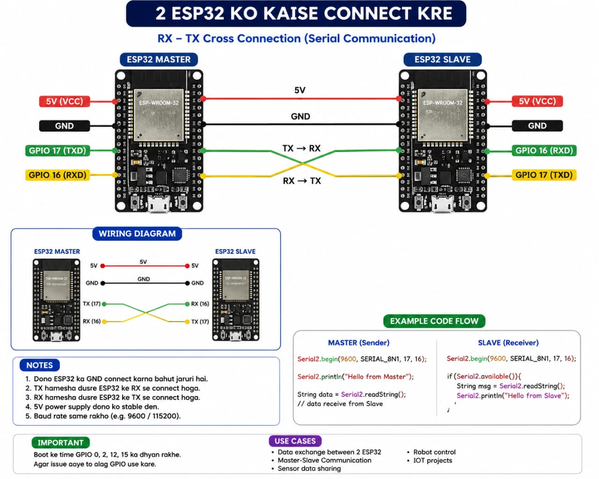

<div align="center">

# Brutus

### One assistant, many brains, two robots. It listens on your phone, thinks on whatever hardware you point it at, and answers with a face full of servos.

[](https://flutter.dev)
[](https://www.qualcomm.com)
[](https://github.com/ggml-org/llama.cpp)
[](https://www.arduino.cc)
[](https://developer.android.com)
[](LICENSE)

<br/>




<br/>
<sub>Talk to it, and its face talks back. Voice, vision, two robots, and 25 plus tools, with a brain you can move from the cloud all the way down to a chip beside the robot.</sub>

</div>

<br/>

## Team Brutus

| Name | Email |
|:--|:--|
| Aditya Pandey | aditya060806@gmail.com |
| Palak Rai | palakrai32323@gmail.com |
| Avik Srivastava | aviksrivastava786@gmail.com |

<br/>

## What this is

Brutus is one project made of parts that need each other.

The part you hold is an Android app built in Flutter. You talk, it listens, it answers out loud, and it can actually do things: read your mail, search the web, run deep research, look through a camera, read your screen, open apps, send messages, generate images, and more.

The part you point it at is a brain. Brutus does not lock you to one. It can think in the cloud on Gemini, or on a Snapdragon X Elite that runs a four billion parameter model on its NPU, or on a half billion parameter model running under llama.cpp on a tiny board next to the robot, or on a model that lives entirely inside the phone with no network at all. Same conversation, same face, same tools. You just choose how much muscle and how much privacy you want.

The part that makes people smile is the robot. Actually two of them. A face built on an Arduino Uno moves its eyes and mouth as Brutus speaks, and a second, larger build splits a body controller and an audio controller across two ESP32 boards with a camera for eyes. When Brutus talks, the mouth moves with the voice, the expression follows the tone, and it can nod, wink, laugh, or look around on command.

Two things were the hard parts, and both work:

* Brutus takes turns like a person. It hears your whole sentence, replies to that, then listens again. It does not talk over you, and it does not trip on the tail of its own voice returning through the speaker.
* Brutus answers in the language you speak. Say something in Hindi and you get Hindi back. Switch to English mid sentence and it switches with you.

<br/>

## At a glance

| Thing | Count |
|:--|:--|
| Brains you can switch between | 5 tiers, cloud to fully on device |
| Robots | 2 (Arduino Uno face, ESP32 body plus camera) |
| Feature screens | 15 |
| AI tools it can call | 25 plus |
| Robot animations | 20 (10 macros, 10 tricks) |
| Facial expressions | 6, each with a 0 to 100 intensity dial |
| Servos in the head | 4 (eye left/right, eye up/down, eyelid, mouth) |
| BLE command types | 11 |
| On device ML | Speech turn taking, OCR, face tracking |
| Architecture | Feature first, Riverpod, GoRouter |

<br/>

## The brains: cloud to edge

This is the heart of the project. Every brain speaks the same simple contract to the app (audio in, audio out, an optional tool call, and a leading `[EMOTION:xxx]` tag), so the chat, the robot, and the face never care which one is running. You swap the brain, everything else stays.

| Tier | Brain | Model | Runs on | Offline | Best for |
|:--|:--|:--|:--:|:--:|:--|
| 1 | Cloud voice | Gemini Live (`gemini-2.5-flash-native-audio-preview`) | Google | No | The most natural live conversation |
| 1 | Cloud Indic | Sarvam (`sarvam-30b` / `sarvam-105b`, Bulbul TTS) | Sarvam | No | Hindi, Tamil, and other Indian languages |
| 1 | Cloud reasoning | Groq (`llama-3.3-70b-versatile`) | Groq | No | Fast deep research and document answers |
| 2 | Edge, powerful | Qwen3 4B, quantized W4A16 | Snapdragon X Elite, Hexagon NPU | Yes, on LAN | A capable brain with nothing leaving your network |
| 3 | Edge, tiny | Qwen2.5 0.5B Instruct, Q5_K_M GGUF | llama.cpp on a Pi class board | Yes, on LAN | An always on micro brain for quick commands |
| 4 | On the phone | Gemma3 1B chat plus FastVLM vision | The phone's own NPU | Yes, fully | Zero network, works in airplane mode |

Tiers 2, 3, and 4 all run on the edge. The Snapdragon node and the llama.cpp node both expose an OpenAI shaped chat endpoint on the LAN, and the phone brain runs a small foreground service that the app reaches on localhost. Only tier 1 leaves the device, and only when you choose it.

<br/>

## Compression, or how these models fit on small hardware

Big models do not fit on an NPU or a Raspberry Pi by themselves. Quantization is what makes it work: trade a little precision for a large drop in size, and the model runs where a full precision one never could. Here are the on device brains at full precision versus the quantized build that actually ships.

```
On device model footprint  (full precision vs the quantized build we run)

  Qwen3 4B      FP16   ████████████████████████   ~8.0 GB
  (Snapdragon)  W4A16  █████████                  ~3.0 GB     2.7x smaller

  Gemma3 1B     FP16   ██████                     ~2.0 GB
  (phone NPU)   INT4   ██                         ~0.5 GB     ~4x smaller

  Qwen2.5 0.5B  FP16   ███                        ~1.0 GB
  (llama.cpp)   Q5_K_M █                          ~0.42 GB    ~2.4x smaller
```

| Model | Full precision | Quantized build | Shrink | Where it runs |
|:--|:--|:--|:--:|:--|
| Qwen3 4B | ~8.0 GB (FP16) | ~3.0 GiB (W4A16) | ~2.7x | Snapdragon X Elite NPU |
| Gemma3 1B | ~2.0 GB (FP16) | ~0.5 GB (INT4, approx.) | ~4x | On the phone NPU |
| Qwen2.5 0.5B Instruct | ~1.0 GB (FP16) | ~0.42 GB (Q5_K_M) | ~2.4x | llama.cpp micro node |

W4A16 keeps activations at sixteen bits while squeezing the weights to four, so the big model stays sharp. Q5_K_M is a five bit GGUF mix that keeps a half billion parameter model under half a gigabyte, small enough to stay resident on a board that costs less than lunch.

<br/>

## Efficiency, and where your data lives

The design goal is simple. Do as much as possible on the device, reach for the cloud only when it truly helps, and never restart what you can keep warm.

```
Stays on your phone, no cloud round trip:
  Speech turn taking and echo control   ██████████
  Screen text reading (OCR)             ██████████
  Face tracking that drives the eyes    ██████████
  Chat history, notes, API keys         ██████████
  App control and automation            ██████████

Stays on your LAN when you pick an edge brain:
  Qwen3 4B reasoning (Snapdragon NPU)   ██████████   about 15 tokens per second
  Qwen2.5 0.5B quick replies (llama.cpp) ██████████  4 CPU threads, 1024 token window

Uses the cloud only when you choose it:
  Gemini live voice and vision          ██████████
  Sarvam Indic voice and chat           ██████████
  Web and deep research (Tavily, Groq)  ██████████
```

A few choices that keep it light on its feet:

* One audio track stays open for the whole session, so there is no stop and start churn between voice chunks and no fight over audio focus with the mic.
* The mic stays open the whole time and chunks are simply dropped while Brutus talks, so there is no cost to restart recording every turn.
* Playback completion is measured from the real length of the audio, not from when data stopped arriving, so the mic reopens the instant Brutus is genuinely done and not a moment before.
* Camera and screen frames pause while audio is flowing, so a big image never chokes the voice channel.
* Every edge brain loads its model once and holds it resident, so the first request after boot is warm, not a cold start.

<br/>

## How it works

You speak into the phone. The audio streams to the chosen brain. The brain streams voice back, plus any tool calls it wants to run. The voice plays through a single native audio track, and at the same time the phone tells the robot how to move its mouth and face. Tools run on the phone and hand their results back so the conversation keeps flowing.

```
        You speak
           │
           ▼
     ┌───────────┐        camera / screen / robot-cam frames
     │  Mic PCM  │◄───────────────────────────────────────┐
     └─────┬─────┘   (dropped while Brutus is talking)     │
           │                                               │
           ▼                                               │
     ┌────────────────────────────┐            ┌───────────┴────────┐
     │   The brain you picked      │◄──────────►│  Vision + Screen   │
     │   cloud · Snapdragon · Pi · │            └────────────────────┘
     │   or the phone itself       │
     └───────┬────────────────────┘
             │
       ┌─────┴───────────────┐
       ▼                     ▼
  ┌──────────┐        ┌───────────────┐
  │  Voice   │        │  Tool calls   │
  │  stream  │        │  (25 plus)    │
  └────┬─────┘        └───────────────┘
       │
   ┌───┴───────────────────────────┐
   ▼                               ▼
┌───────────────┐        ┌──────────────────────────┐
│  Speaker      │        │  Robots over BLE          │
│  (AudioTrack) │        │  mouth, eyes, mood, LED,  │
└───────────────┘        │  body, animations         │
                         └──────────────────────────┘
```

<br/>

## Pick your voice and your brain

In Settings, under AI Providers, you choose who speaks and who thinks. This is where the tiers above become one tap each.

**Who speaks (text to speech)**

| Engine | What it is | Good for | Needs a key | Works offline |
|:--|:--|:--|:--:|:--:|
| Gemini | The live native voice (Puck or Aoede) | The most natural, in conversation feel | Yes | No |
| Sarvam Bulbul | 30 plus expressive Indian language voices | Hindi, Tamil, and other Indic speech | Yes | No |
| Edge brain | On device speech, wrapped around the local model | No network, full privacy | No | Yes |
| System | The phone's built in voice | A fallback that always works | No | Yes |

**Who thinks**

| Engine | What it is | Good for | Needs a key |
|:--|:--|:--|:--:|
| Gemini Live | Cloud native audio model | The richest live conversation | Yes |
| Snapdragon Qwen3 4B | A capable model on the NPU, on your LAN | Private, no data leaves the network | No |
| llama.cpp Qwen2.5 0.5B | A tiny model on a small board | Instant short answers and commands | No |
| Phone Gemma3 1B | A model inside the phone | Airplane mode, zero network | No |
| Groq or Sarvam | Cloud text models for research and the notes oracle | Long form synthesis | Yes |

Your keys are stored in the phone's encrypted storage. Nothing is hardcoded, and nothing is committed to the repo.

<br/>

## Brutus next to the usual assistants

| Capability | Brutus | Google Assistant | Alexa | ChatGPT app |
|:--|:--:|:--:|:--:|:--:|
| Realtime streamed voice | Yes | Yes | Yes | Yes |
| Runs its brain fully on the edge | Yes | No | No | No |
| Works with no network at all | Yes | No | No | No |
| A physical face that lip syncs | Yes | No | No | No |
| Expression that follows the tone of the reply | Yes | No | No | No |
| 20 named animations on command | Yes | No | No | No |
| Sees your screen and helps with it | Yes | Some | No | Yes |
| Live camera vision | Yes | Some | No | Yes |
| Types and taps for you on the phone | Yes | No | No | No |
| Reads and writes your Gmail | Yes | Yes | No | No |
| Answers over your own documents | Yes | No | No | Yes |
| Answers in your language, every turn | Yes | Some | Some | Yes |
| You bring your own keys, or none | Yes | No | No | No |
| Open source, yours to host | Yes | No | No | No |

<br/>

## App features

### Voice and conversation

| Feature | What it does |
|:--|:--|
| Realtime voice | Continuous mic streaming to the brain you picked |
| Takes turns | Hears your whole sentence, replies, then listens again |
| Speaks your language | Mirrors your language and script on every turn |
| No self echo | Never mistakes the tail of its own reply for your input |
| Live transcripts | See both sides of the conversation as it happens |
| Text fallback | Drops to text mode cleanly if the live link goes down |
| Chat history | Last 200 messages saved on the phone |
| Speak for me | Type something and Brutus reads it out in its own voice |

### Vision and screen

| Feature | What it does |
|:--|:--|
| Camera vision | Point the camera and Brutus sees and understands what is there |
| Screen share | Share your screen and Brutus helps with what is on it |
| Robot eyes see too | The ESP32 camera streams the robot's view into the vision model |
| Bandwidth modes | Standard and low data, so it works on a weak connection |
| Smart frame skip | Frames pause during audio to keep voice smooth |

### Eye tracking

Point the phone's back camera at the room and a face detector runs on the phone with ML Kit at about eleven frames a second. Brutus maps whoever it sees to the eye servos, so the robot's eyes follow you around. No face in view and the eyes recenter on their own. Nothing about this leaves the phone.

### Tools it can actually use

<table>
<tr>
<td valign="top">

**Talk to people**
<br/>Gmail read and compose
<br/>WhatsApp send
<br/>SMS composer
<br/>Phone calls
<br/>Contact lookup

</td>
<td valign="top">

**Find things out**
<br/>Web search (Tavily)
<br/>Deep research
<br/>Weather (Open-Meteo)
<br/>Stock prices (Yahoo)
<br/>Read text with the camera

</td>
<td valign="top">

**Get things done**
<br/>Notes
<br/>Oracle over your docs
<br/>Image generation
<br/>Maps (OpenStreetMap)
<br/>Timers

</td>
<td valign="top">

**Run the phone**
<br/>Open any app
<br/>Flashlight
<br/>Ringer mode
<br/>Type and tap for you
<br/>Read the screen
<br/>Read notifications
<br/>Settings panels

</td>
</tr>
</table>

### Look and feel

* Material 3, warm indigo palette
* An animated particle sphere that pulses with Brutus's voice
* Frosted glass navigation and smooth page transitions
* 15 screens: Home, Chat, Robot Control, Tools, Settings, Email, Notes, Research, Oracle, Gallery, Maps, Stocks, Weather, Search, Automation

<br/>

## The two robots

### Robot One, the face (Arduino Uno)

Four micro servos, an LED, a sound sensor, and an HM 10 Bluetooth module, all run by an Arduino Uno. The phone drives it over Bluetooth Low Energy.

| Part | Qty | Pin | Job |
|:--|:--:|:--:|:--|
| Arduino Uno (or Nano) | 1 | | The brain of the head |
| HM 10 BLE module | 1 | D10 (RX), D11 (TX) | Talks to the phone |
| SG90 servo, eye left/right | 1 | D3 | Eyes side to side |
| SG90 servo, eye up/down | 1 | D5 | Eyes up and down |
| SG90 servo, eyelid | 1 | D6 | Blink and eyelids |
| SG90 servo, mouth | 1 | D9 | Jaw and lip sync |
| LED | 1 | D8 | Status and mood |
| Sound sensor | 1 | A0 | Idle mode lip flap |
| 5V supply, 2A or more | 1 | | Power for the servos |

Rough cost to build: about 15 to 25 US dollars.

```
                  ┌────────────────────────┐
                  │       Arduino Uno      │
  HM10 TXD ─────► │ D10  (soft serial RX)  │
  HM10 RXD ◄───── │ D11  (soft serial TX)  │  use a voltage divider here
  Eye L/R  ◄───── │ D3   (PWM)             │
  Eye U/D  ◄───── │ D5   (PWM)             │
  Eyelid   ◄───── │ D6   (PWM)             │
  Mouth    ◄───── │ D9   (PWM)             │
  LED      ◄───── │ D8   (digital)         │
  Sound    ─────► │ A0   (analog)          │
  5V ext   ─────► │ 5V                     │
  GND ──────────── │ GND  (shared ground)  │
                  └────────────────────────┘
```

> One thing to watch: the HM 10 RXD pin runs at 3.3V logic. Put a divider (a 1k and a 2k resistor) between Arduino D11 and the HM 10 RXD. The other direction, TXD into D10, is fine as is.

### Robot Two, the v2 build (ESP32, split controllers, camera eyes)

The bigger build spreads the work across two ESP32 boards plus a camera, so motion and sound do not fight for one microcontroller.

* **Body controller** (`arduino/brutus_v2_body`) drives the larger motion.
* **Audio controller** (`arduino/brutus_v2_audio`) handles sound on its own board.
* **ESP32-CAM eyes** (`esp32cam_stream`) serve an MJPEG stream at `http://<ip>:81/stream`. The app parses those frames itself, shows them, and forwards them to the vision model, so Brutus literally sees through the robot's eyes.

### The BLE protocol

The phone talks to the face over a BLE serial characteristic (`0000FFE1`). Commands are plain text, one per line.

| Command | Meaning | Example |
|:--|:--|:--|
| `E<n>` | Set expression 0 to 5 | `E0` for happy |
| `E<n>,<i>` | Expression with intensity 0 to 100 | `E1,50` |
| `M<a>` | Mouth angle 0 to 180 for lip sync | `M140` |
| `L<lr>,<ud>` | Look at, both eye axes | `L60,70` |
| `B` | Blink once | `B` |
| `I<0/1>` | Idle behavior on or off | `I1` |
| `S<0/1>` | Freeze, stop all autonomous motion | `S1` |
| `A<n>` | Play animation macro 0 to 9 | `A3` |
| `W<n>` | Play movement trick 0 to 9 | `W5` |
| `C<n>` | LED pattern, 0 off to 3 fast | `C2` |
| `H` | Heartbeat, replies `OK` | `H` |

Mouth commands are rate limited to about 40 a second and eye commands to about 30, with a small dead zone, so the joystick and the lip sync never flood the slow BLE link.

### Expressions

| Index | Expression | Look |
|:--:|:--|:--|
| 0 | Happy | Relaxed eyes, small smile |
| 1 | Angry | Squinted eyes, tight jaw |
| 2 | Sad | Droopy eyes, gaze away, frown |
| 3 | Thinking | Eyes up and to the left, neutral mouth |
| 4 | Sleepy | Eyes almost closed |
| 5 | Surprised | Eyes wide, mouth open |

Every expression scales from 0 (neutral) to 100 (full) with the intensity value.

### Animations and tricks

Twenty ready made sequences run on the Arduino as non blocking keyframes, so the head stays responsive to new commands while it moves.

| Macros (A) | Tricks (W) |
|:--|:--|
| Nod, Shake, Look around | Crazy eyes, Chatter, Slow scan |
| Wink, Yawn, Laugh | Peekaboo, Double blink, Jaw drop |
| Eye roll, Mouth cycle | Drowsy, Side eye |
| Eye cycle, Wiggle | Happy bounce, Confused |

### It reacts on its own

When it is connected and auto drive is on, the head follows the conversation without being told. While Brutus talks, it reads emotion cues out of the reply and switches the expression and LED to match, so an angry sentence looks angry and a happy one looks happy.

| State | Expression | LED | Head |
|:--|:--|:--|:--|
| Listening | Happy | Solid | Eyes centered, attentive |
| Thinking | Thinking | Pulse | Eyes drift up |
| Speaking | Matches the tone | Solid | Mouth moves with the voice |
| Idle | Thinking | Pulse | Eyes centered |
| Error | Sad | Fast blink | Blink, mouth closed |

### Say it out loud

The brain can trigger the head straight from speech.

> "Brutus, nod your head" plays the nod.
> "Wink at them" plays the wink.
> "Do crazy eyes" plays the crazy eyes trick.
> "Act confused" plays the confused trick.

<br/>

## Setup

You need Flutter installed and an Android phone on Android 8 or newer. With a Gemini key you get the full cloud experience straight away. The edge brains and the robots are optional and slot in whenever you want.

### 1. Run the app

```bash
git clone https://github.com/Aditya060806/Brutus-app.git
cd Brutus-app/brutus_app
flutter pub get
flutter run --release
```

### 2. Add a key (for the cloud tier)

Open the app, go to Settings, then API Keys, and paste your Gemini key from [Google AI Studio](https://aistudio.google.com). Keys go into the phone's encrypted storage. Groq, Tavily, Hugging Face, and Sarvam are optional and only needed for the features that use them.

Prefer a file while developing? Copy the template. It is git ignored, so your keys never get committed.

```bash
cp lib/core/constants/app_config.example.dart lib/core/constants/app_config.dart
```

### 3. Point it at an edge brain (optional, this is the fun part)

**The tiny LAN brain (llama.cpp on a Pi class board).** Build llama.cpp, drop a Qwen2.5 0.5B GGUF on the board, and serve it on the network:

```bash
~/llama.cpp/build/bin/llama-server \
  -m /home/arduino/qwen2.5-0.5b-instruct-q5_k_m.gguf \
  --port 8081 -c 1024 -t 4 --host 0.0.0.0
```

Then in Settings, under AI Providers, set the edge chat URL to `http://<board-ip>:8081`. The endpoint is OpenAI shaped, so the app talks to it the same way it talks to any other chat model.

**The powerful LAN brain (Snapdragon X Elite).** Run the Brutus Brain Node (the companion server) so Qwen3 4B serves on the NPU at `http://<pc-ip>:8080`, then point the app at that URL. See [Ai-Qualcom-backend](https://github.com/Aditya060806/Ai-Qualcom-backend).

**The phone brain.** Nothing to configure. When the on device EdgeBrain service is running, pick it in Settings and Brutus works with the network off.

### 4. Add the robots (optional)

Robot One, the face:

1. Open `arduino/brutus_face_robot/brutus_face_robot.ino` in the Arduino IDE.
2. Pick your board and upload.
3. Power the servos from an external 5V 2A supply. USB alone cannot drive four servos.
4. In the app, open Robot Control, scan, and tap your HM 10 to connect.

Robot Two, the v2 build:

1. Flash `arduino/brutus_v2_body` and `arduino/brutus_v2_audio` to their ESP32 boards.
2. Flash `esp32cam_stream` to the ESP32-CAM and note the IP it prints.
3. In the app, open the robot camera panel and enter that IP to stream the robot's eyes into the vision model.

> The HM 10 usually shows up as `HMSoft`, `BT05`, or `MLT-BT05`. There is no pairing step. It is BLE, not classic Bluetooth.

<br/>

## Using it

* Tap the orb on the home screen and just talk. Watch the transcript fill in on both sides.
* Ask it to see: "what am I looking at" opens the camera, "read my screen" runs OCR on device.
* Ask it to do: "email Aditya that I am running late", "what is the weather", "open WhatsApp", "research on device AI and summarize".
* Ask it to move: "nod", "wink at them", "look confused", or turn on eye tracking and let it follow you.
* Switch brains any time in Settings. Pull the network and switch to the phone or LAN brain to see it keep going with nothing leaving your device.

<br/>

## Tests and testing instructions

* **Static analysis:** `flutter analyze` from `brutus_app` should report no issues.
* **Unit and widget tests:** `flutter test` runs the suite in `test/`.
* **Edge brain reachability:** with a llama.cpp or Snapdragon node running, `curl http://<ip>:<port>/v1/models` (llama.cpp) or `curl http://<ip>:8080/health` (Snapdragon node) confirms the app will reach it.
* **Robot link:** the app's Robot Control panel shows live connection state and echoes the heartbeat, so you can confirm the BLE link before a demo.

<br/>

## Project layout

```
brutus_app/
├── lib/
│   ├── core/         constants (endpoints, config), router, theme, shared widgets
│   ├── data/
│   │   ├── services/ voice backends, Sarvam, audio, vision, BLE robot, eye tracking, ESP32-CAM
│   │   └── tools/    Tavily, weather, stocks, and the rest of the tool layer
│   ├── features/     15 feature modules (chat, robot, robot_eyes, oracle, research, ...)
│   └── providers/    Riverpod state notifiers
├── arduino/
│   ├── brutus_face_robot/   Robot One firmware (Arduino Uno)
│   ├── brutus_v2_body/      Robot Two body controller (ESP32)
│   └── brutus_v2_audio/     Robot Two audio controller (ESP32)
├── esp32cam_stream/         ESP32-CAM eyes (MJPEG stream)
├── android/
│   └── app/src/main/kotlin/ native audio, screen capture, accessibility
└── assets/
    ├── screenshots/  the photos in this README
    ├── images/
    └── animations/
```

### Under the hood

| Layer | Tech |
|:--|:--|
| Framework | Flutter 3, Dart 3 |
| State | Riverpod 2 |
| Navigation | GoRouter |
| Networking | Dio for REST, `dart:io` and `web_socket_channel` sockets for the brains |
| Storage | Hive for data, flutter_secure_storage for keys |
| Audio out | Native AudioTrack at 24 kHz |
| Audio in | `record` for 16 kHz PCM streaming |
| Vision | `camera` frames into the vision model, plus ESP32-CAM MJPEG |
| Robot | `flutter_blue_plus` into the HM 10, then Arduino, plus ESP32 over WiFi |
| On device ML | ML Kit for OCR and face detection |
| Edge brains | OpenAI shaped chat over the LAN (Snapdragon, llama.cpp), localhost hub for the phone brain |

<br/>

## The build, up close

<div align="center">
<table>
<tr>
<td align="center"><br/><sub>Servo layout</sub></td>
<td align="center"><br/><sub>Wiring inside the head</sub></td>
<td align="center"><br/><sub>Assembled</sub></td>
</tr>
<tr>
<td align="center"><br/><sub>The face</sub></td>
<td align="center"><br/><sub>The app</sub></td>
<td align="center"><br/><sub>The app in use</sub></td>
</tr>
</table>
</div>

<br/>

## Permissions and why

| Permission | Why it is needed |
|:--|:--|
| Record audio | Stream your voice to the brain |
| Camera | Vision and eye tracking |
| Internet | The live socket and every cloud call |
| Bluetooth scan and connect | Talk to the robot head |
| Foreground service | Keep screen capture and the phone brain alive |
| Media projection | Screen share with the vision model |
| Accessibility service | Type, tap, and read the screen for you |
| Notification listener | Read your notifications when asked |
| Read contacts | Look up people for calls and messages |

<br/>

## Notes

* The five brains share one contract, so the robot, the emotion tags, and the tool layer are identical no matter which brain runs. That is what lets a half billion parameter model on a Pi stand in for a cloud model with no change to the app.
* The llama.cpp node runs the model resident with four CPU threads and a 1024 token window, sized to stay quick for short commands on a small board.
* The phone brain works in airplane mode because the model and the app live on the same device.
* Robot One is the compact Arduino Uno face. Robot Two splits body and audio across two ESP32 boards and adds camera eyes, so it can move more and see.

<br/>

## Roadmap

* A phone number you can call, so Brutus picks up and talks in realtime
* A wake word, "Hey Brutus"
* iOS build
* Automatic brain selection based on network and battery
* An RGB LED strip for real color moods
* A neck servo so the whole head can track you

<br/>

## References

* Flutter and Dart: <https://flutter.dev>
* Gemini API: <https://ai.google.dev>
* Sarvam AI: <https://www.sarvam.ai>
* Groq: <https://groq.com>
* llama.cpp: <https://github.com/ggml-org/llama.cpp>
* Qwen2.5 0.5B Instruct: <https://huggingface.co/Qwen/Qwen2.5-0.5B-Instruct>
* Qwen3 4B: <https://huggingface.co/Qwen/Qwen3-4B>
* Gemma: <https://ai.google.dev/gemma>
* ML Kit: <https://developers.google.com/ml-kit>
* flutter_blue_plus: <https://pub.dev/packages/flutter_blue_plus>
* The Snapdragon Brain Node (companion server): <https://github.com/Aditya060806/Ai-Qualcom-backend>

<br/>

## License

MIT. See [LICENSE](LICENSE).

<div align="center">
<br/>
<sub>Built with Flutter, a stack of models from the cloud down to the edge, and a lot of servos.</sub>
</div>
