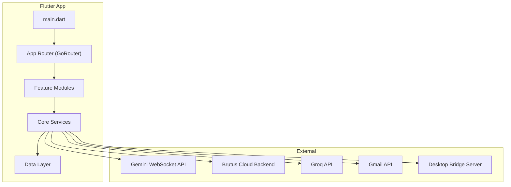
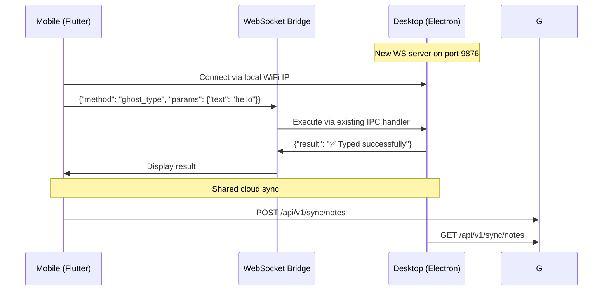

# Brutus Mobile — Flutter Implementation Plan

> **Target**: `D:\Endeavors\Coding\Projects\Brutus-app`
> **Platform**: Android (Flutter)
> **Design**: Clean, light, modern UI with smooth animations — NOT cyberpunk

---

## 1. Architecture Overview



### State Management: **Riverpod 2.x**
- Type-safe, compile-time checked, testable
- `AsyncNotifier` for all async operations
- `StreamProvider` for WebSocket/real-time data

### Navigation: **GoRouter**
- Declarative routing with deep linking
- Shell routes for bottom nav persistence

### HTTP: **Dio**
- Token refresh interceptor (mirrors existing `AxiosInstance.ts`)
- Backend base URL: `brutus-web1002.vercel.app`

### Local Storage: **Hive** + **flutter_secure_storage**
- Hive for chat history, notes, preferences
- flutter_secure_storage for API keys (replaces Electron safeStorage)

---

## 2. Project Structure

```
brutus_app/
├── lib/
│   ├── main.dart
│   ├── app.dart                        # MaterialApp + GoRouter + Theme
│   ├── core/
│   │   ├── theme/
│   │   │   ├── app_theme.dart          # Light theme + Material 3
│   │   │   ├── app_colors.dart         # Color palette
│   │   │   └── app_typography.dart     # Google Fonts (Inter/Outfit)
│   │   ├── router/
│   │   │   └── app_router.dart         # GoRouter config
│   │   ├── constants/
│   │   │   └── api_constants.dart      # Endpoints
│   │   ├── utils/
│   │   │   ├── audio_utils.dart        # PCM encoding/decoding
│   │   │   └── extensions.dart
│   │   └── widgets/                    # Shared UI components
│   │       ├── glass_card.dart
│   │       ├── animated_gradient.dart
│   │       ├── shimmer_loading.dart
│   │       └── brutus_bottom_nav.dart
│   ├── data/
│   │   ├── models/                     # Freezed data classes
│   │   │   ├── chat_message.dart
│   │   │   ├── email_model.dart
│   │   │   ├── weather_model.dart
│   │   │   ├── stock_model.dart
│   │   │   ├── note_model.dart
│   │   │   └── user_profile.dart
│   │   ├── repositories/
│   │   │   ├── auth_repository.dart
│   │   │   ├── chat_repository.dart
│   │   │   ├── email_repository.dart
│   │   │   └── settings_repository.dart
│   │   └── services/
│   │       ├── gemini_voice_service.dart    # WebSocket to Gemini
│   │       ├── auth_service.dart            # Google OAuth
│   │       ├── dio_client.dart              # HTTP + interceptors
│   │       ├── secure_storage_service.dart  # API key vault
│   │       ├── notification_service.dart    # FCM + local
│   │       ├── desktop_bridge_service.dart  # Connect to Electron
│   │       └── groq_service.dart            # Fast inference
│   ├── features/
│   │   ├── auth/
│   │   │   ├── login_screen.dart
│   │   │   └── biometric_lock_screen.dart
│   │   ├── home/
│   │   │   ├── home_screen.dart            # Main dashboard
│   │   │   ├── widgets/
│   │   │   │   ├── ai_orb_widget.dart      # Animated AI indicator
│   │   │   │   ├── quick_actions_grid.dart
│   │   │   │   └── status_cards.dart
│   │   │   └── home_controller.dart
│   │   ├── chat/
│   │   │   ├── chat_screen.dart
│   │   │   ├── widgets/
│   │   │   │   ├── chat_bubble.dart
│   │   │   │   ├── voice_input_bar.dart
│   │   │   │   └── tool_result_card.dart
│   │   │   └── chat_controller.dart
│   │   ├── email/
│   │   │   ├── email_inbox_screen.dart
│   │   │   ├── email_detail_screen.dart
│   │   │   ├── compose_email_screen.dart
│   │   │   └── email_controller.dart
│   │   ├── weather/
│   │   │   └── weather_card.dart
│   │   ├── stocks/
│   │   │   ├── stock_screen.dart
│   │   │   └── stock_chart_widget.dart
│   │   ├── notes/
│   │   │   ├── notes_screen.dart
│   │   │   └── note_editor_screen.dart
│   │   ├── gallery/
│   │   │   └── gallery_screen.dart
│   │   ├── maps/
│   │   │   └── map_screen.dart
│   │   ├── automation/
│   │   │   ├── automation_screen.dart      # Workflows/macros
│   │   │   └── workflow_builder.dart
│   │   ├── research/
│   │   │   ├── deep_research_screen.dart
│   │   │   └── rag_oracle_screen.dart
│   │   ├── files/
│   │   │   ├── file_browser_screen.dart
│   │   │   └── smart_sort_screen.dart
│   │   ├── phone_control/
│   │   │   ├── accessibility_service.dart  # Native Android
│   │   │   ├── app_launcher.dart
│   │   │   └── device_info_screen.dart
│   │   └── settings/
│   │       ├── settings_screen.dart
│   │       ├── api_keys_screen.dart
│   │       ├── personality_screen.dart
│   │       └── security_screen.dart
│   └── providers/                          # Riverpod providers
│       ├── auth_providers.dart
│       ├── chat_providers.dart
│       ├── voice_providers.dart
│       ├── email_providers.dart
│       └── settings_providers.dart
├── android/
│   └── app/src/main/
│       ├── kotlin/.../
│       │   ├── MainActivity.kt
│       │   ├── BrutusAccessibilityService.kt   # Phone automation
│       │   └── NativeAudioBridge.kt            # PCM audio
│       └── AndroidManifest.xml
├── assets/
│   ├── fonts/
│   ├── images/
│   └── animations/                         # Lottie/Rive files
├── test/
└── pubspec.yaml
```

---

## 3. Design System — Clean & Modern

### Color Palette (Light-First)
```dart
// app_colors.dart
class AppColors {
  // Primary — Warm indigo/blue
  static const primary = Color(0xFF4F46E5);       // Indigo 600
  static const primaryLight = Color(0xFF818CF8);   // Indigo 400
  static const primarySurface = Color(0xFFEEF2FF); // Indigo 50

  // Surfaces
  static const background = Color(0xFFFAFAFB);    // Near-white
  static const surface = Color(0xFFFFFFFF);
  static const surfaceVariant = Color(0xFFF4F4F5); // Zinc 100
  static const cardElevated = Color(0xFFFFFFFF);

  // Text
  static const textPrimary = Color(0xFF18181B);    // Zinc 900
  static const textSecondary = Color(0xFF71717A);  // Zinc 500
  static const textTertiary = Color(0xFFA1A1AA);   // Zinc 400

  // Accents
  static const success = Color(0xFF10B981);        // Emerald
  static const warning = Color(0xFFF59E0B);        // Amber
  static const error = Color(0xFFEF4444);          // Red
  static const info = Color(0xFF3B82F6);           // Blue

  // Gradients
  static const heroGradient = LinearGradient(
    colors: [Color(0xFF4F46E5), Color(0xFF7C3AED)],
  );
}
```

### Typography
```dart
// Google Fonts: Inter for body, Outfit for headings
textTheme: TextTheme(
  displayLarge: GoogleFonts.outfit(fontSize: 32, fontWeight: FontWeight.w700),
  headlineMedium: GoogleFonts.outfit(fontSize: 24, fontWeight: FontWeight.w600),
  titleLarge: GoogleFonts.inter(fontSize: 18, fontWeight: FontWeight.w600),
  bodyLarge: GoogleFonts.inter(fontSize: 16),
  bodyMedium: GoogleFonts.inter(fontSize: 14),
  labelSmall: GoogleFonts.inter(fontSize: 11, letterSpacing: 1.2),
)
```

### Component Style
- **Cards**: White with subtle shadow (`elevation: 0`, `border: 1px zinc-100`), 16px radius
- **Buttons**: Rounded (12px), filled primary or outlined
- **Bottom Nav**: Frosted glass effect with blur
- **Animations**: `Hero` transitions, `AnimatedContainer`, Lottie for AI orb

---

## 4. Feature Implementation Phases

### Phase 1 — Foundation (Week 1-2)

| Task | Details |
|------|---------|
| **Project Setup** | `flutter create --org com.adityapandey brutus_app` at target path |
| **Dependencies** | Riverpod, GoRouter, Dio, Hive, google_fonts, flutter_animate, lottie |
| **Theme** | Full Material 3 light theme with custom color scheme |
| **Auth** | Google Sign-In → backend token → Zustand-equivalent auth state |
| **Biometric Lock** | `local_auth` package for fingerprint/face unlock on every launch |
| **Secure Storage** | `flutter_secure_storage` for API keys (mirrors Electron safeStorage) |
| **Navigation Shell** | Bottom nav: Home, Chat, Tools, Settings |
| **Dio Client** | Token refresh interceptor mirroring `AxiosInstance.ts` logic |

### Phase 2 — AI Voice Core (Week 3-4)

| Task | Details |
|------|---------|
| **Gemini WebSocket** | Port `GeminiLiveService` → Dart WebSocket (`web_socket_channel`) |
| **Audio Input** | `record` package → PCM 16kHz → base64 → send to Gemini |
| **Audio Output** | Decode base64 PCM from Gemini → `just_audio` playback |
| **Tool Declarations** | Port all 50+ tool schemas to Dart JSON maps |
| **Tool Dispatch** | Map-based dispatcher (replaces if/else chain) |
| **Chat History** | Hive persistence of user/AI messages with transcription |
| **AI Orb** | Animated widget (Rive/Lottie) pulsing during voice activity |
| **Vision Mode** | Camera feed → JPEG frames → send to Gemini via WebSocket |

### Phase 3 — Core Features (Week 5-7)

| Feature | Implementation |
|---------|----------------|
| **Email** | Gmail API via `googleapis` package — read, send, draft |
| **Weather** | OpenWeatherMap API → beautiful animated weather cards |
| **Stocks** | Yahoo Finance API → interactive charts with `fl_chart` |
| **Notes** | Local Hive storage — CRUD with rich text (markdown) |
| **Gallery** | AI-generated images via HuggingFace — cached with `cached_network_image` |
| **Maps** | `google_maps_flutter` — location, navigation, search |
| **Web Search** | Google Custom Search API via Dio |
| **Deep Research** | Tavily API → Groq synthesis (port `deep-research.ts` logic) |
| **RAG Oracle** | Gemini embeddings → local vector store → Groq answer |

### Phase 4 — Phone Automation (Week 8-9)

| Task | Details |
|------|---------|
| **Accessibility Service** | Native Kotlin `BrutusAccessibilityService` for UI automation |
| **App Launch/Close** | `installed_apps` + `android_intent_plus` to open/close apps |
| **Notifications** | `notification_listener_service` to read incoming notifications |
| **File Management** | `path_provider` + `permission_handler` for local file ops |
| **Hardware Toggles** | Platform channels to toggle WiFi, Bluetooth, flashlight |
| **Smart Sort** | File categorization + move to organized folders |
| **WhatsApp** | `url_launcher` + accessibility service for auto-send |
| **Spotify** | Spotify SDK / deep link integration |

### Phase 5 — Desktop Bridge (Week 10)

| Task | Details |
|------|---------|
| **WebSocket Server** | Add a WS server to Electron main process (`ws` package) |
| **Bridge Protocol** | JSON-RPC over WebSocket for command relay |
| **Commands** | ghost_type, click, screenshot, app_launch, file_ops from mobile |
| **Discovery** | mDNS / manual IP entry to find desktop Brutus |
| **Sync** | Chat history, notes, core memory sync via cloud backend |

### Phase 6 — Polish (Week 11-12)

| Task | Details |
|------|---------|
| **Animations** | Page transitions, micro-interactions, haptic feedback |
| **Error Handling** | Graceful degradation, retry logic, offline mode |
| **Performance** | Lazy loading, image caching, isolate-based heavy compute |
| **Testing** | Unit tests for services, widget tests for UI |
| **Release** | App signing, ProGuard, Play Store listing |

---

## 5. Key Dependencies (`pubspec.yaml`)

```yaml
dependencies:
  flutter:
    sdk: flutter

  # State & DI
  flutter_riverpod: ^2.6.0
  riverpod_annotation: ^2.6.0

  # Navigation
  go_router: ^14.0.0

  # Networking
  dio: ^5.8.0
  web_socket_channel: ^3.0.0

  # Auth
  google_sign_in: ^6.2.0
  local_auth: ^2.3.0

  # Storage
  hive_flutter: ^1.1.0
  flutter_secure_storage: ^9.2.0

  # UI & Design
  google_fonts: ^6.2.0
  flutter_animate: ^4.5.0
  lottie: ^3.1.0
  fl_chart: ^0.69.0
  cached_network_image: ^3.4.0
  shimmer: ^3.0.0
  flutter_svg: ^2.0.0

  # AI & Audio
  record: ^5.1.0
  just_audio: ^0.9.0
  permission_handler: ^11.3.0

  # Maps & Location
  google_maps_flutter: ^2.10.0
  geolocator: ^13.0.0

  # Gmail
  googleapis: ^14.0.0
  googleapis_auth: ^1.6.0

  # Data
  freezed_annotation: ^2.4.0
  json_annotation: ^4.9.0

  # Utils
  intl: ^0.19.0
  url_launcher: ^6.3.0
  share_plus: ^10.0.0
  path_provider: ^2.1.0

dev_dependencies:
  build_runner: ^2.4.0
  freezed: ^2.5.0
  json_serializable: ^6.8.0
  riverpod_generator: ^2.6.0
```

---

## 6. Desktop ↔ Mobile Bridge Architecture



To enable this, we add a small WebSocket server module to the Electron app:

```typescript
// src/main/services/mobile-bridge.ts (to add to Electron)
import { WebSocketServer } from 'ws'
// Exposes existing IPC handlers over WebSocket for mobile consumption
```

---

## 7. Feature Parity Matrix

| Electron Feature | Flutter Equivalent | Native Needed? |
|------------------|--------------------|----------------|
| Gemini Voice WebSocket | `web_socket_channel` + `record` | Audio via platform channel |
| Vision (camera/screen) | `camera` package | No |
| Gmail API | `googleapis` package | No |
| Weather/Stocks/Maps | Dio + `fl_chart` + `google_maps_flutter` | No |
| Notes | Hive local storage | No |
| Gallery (AI images) | HuggingFace API + cache | No |
| File Management | `path_provider` + Dart `io` | Permissions |
| App Launch/Close | `android_intent_plus` | No |
| WhatsApp Send | Accessibility Service | **Yes — Kotlin** |
| Spotify Control | Deep links / Spotify SDK | Partial |
| Ghost Type (keyboard) | Accessibility Service | **Yes — Kotlin** |
| Notifications Read | `notification_listener_service` | **Yes — Kotlin** |
| Hardware Toggles | Platform channels | **Yes — Kotlin** |
| Smart Drop Zones | Dart file I/O | Permissions |
| Deep Research | Tavily + Groq APIs | No |
| RAG Oracle | Gemini embeddings + local vector | No |
| Biometric Auth | `local_auth` | No |
| Secure Key Vault | `flutter_secure_storage` | No |
| Desktop Control | WebSocket bridge to Electron | Bridge server |
| Workflow/Macros | Local Hive + sequential executor | No |

---

## 8. Immediate First Steps

1. **Create Flutter project** at `D:\Endeavors\Coding\Projects\Brutus-app`
2. **Install dependencies** from pubspec above
3. **Build theme system** — colors, typography, component styles
4. **Implement auth flow** — Google Sign-In → backend → biometric lock
5. **Build navigation shell** — Bottom nav with 4 tabs
6. **Create home screen** — AI orb, quick actions, status cards
7. **Port Gemini WebSocket** — Voice input/output working

> [!IMPORTANT]
> The native Android accessibility service (`BrutusAccessibilityService.kt`) is the most complex native component. It requires Kotlin code in `android/` and explicit user permission grants. This enables WhatsApp automation, ghost typing, and notification reading — features that are impossible with pure Flutter.

> [!TIP]
> Unlike the Electron app's cyberpunk aesthetic, the Flutter app should use Apple Health / Linear / Notion-inspired design — clean whites, subtle shadows, smooth spring animations, and ample whitespace. This creates a premium mobile experience.
